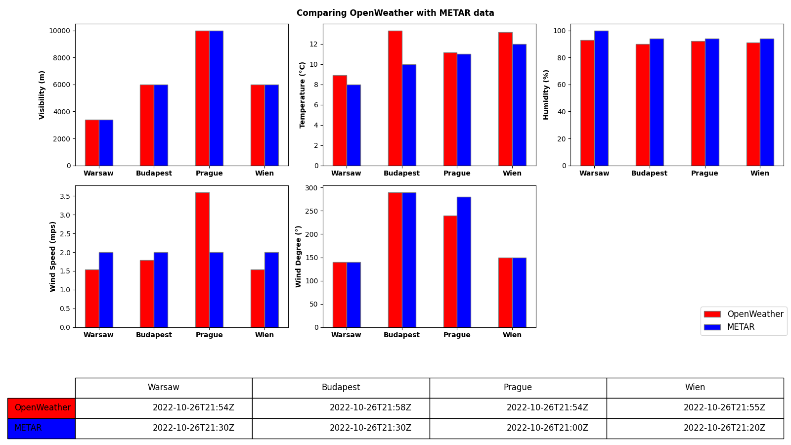

# Comparison of weather data

In this project I am comparing the weather data from **OpenWeather** to the weather data from **checkwx**.

*Known issue: The METAR data from the **checkwx** is sometimes not consistent. Some values are missing like wind. This can cause the program to fail.

This project uses the [bosch_exercise_1](https://github.com/sapipeti/bosch_exercise_1) as a base. We are calling our own API defined there to get the  **OpenWeather** data.

Upon running the project we get a metric printed to console (DataFrame) comparing the weather in these four cities:
- Warsaw
- Budapest
- Prague
- Wien

The metric is also saved to the hard drive in a json format. It can be found in the root project directory under the filename **metric.json**

A plot is also shown which shows the temperature of the cities in Celsius side by side with the date of the data itself. This plot is saved to the root of the project as a png file.

The plot is written generically. Which means future sources of data can be added to the plot instead of the existing ones.

